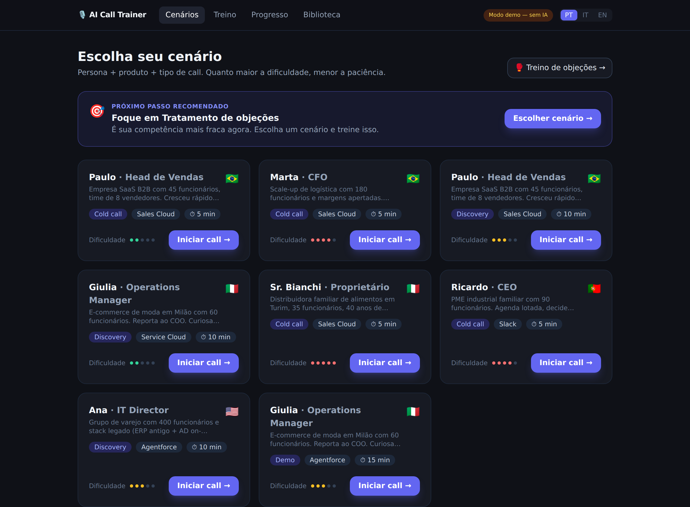
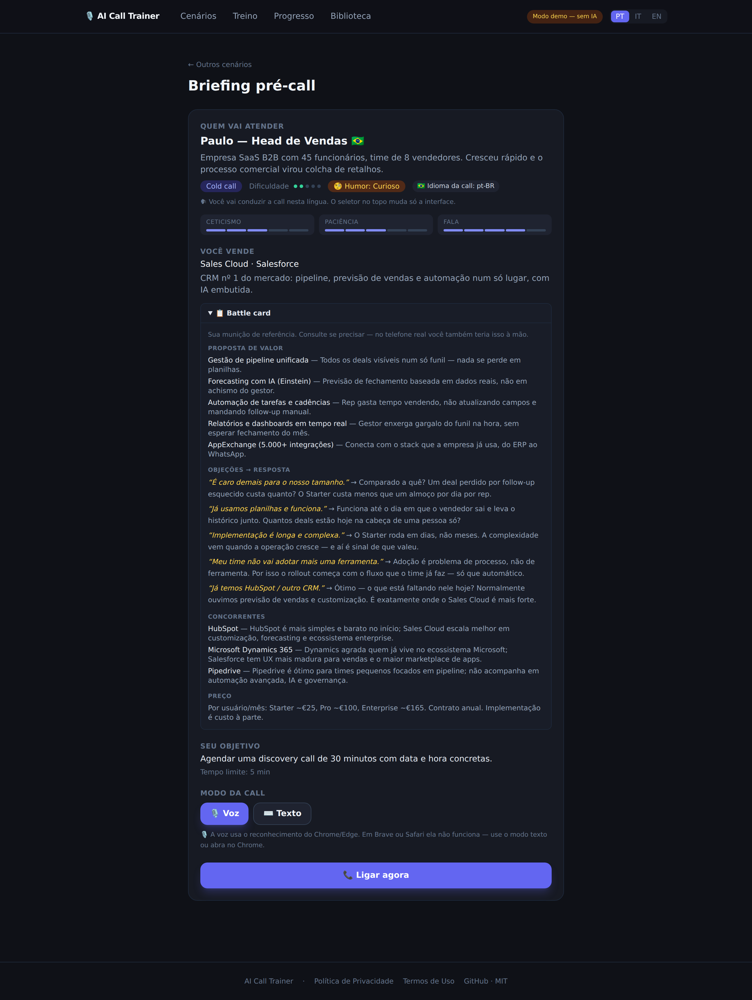
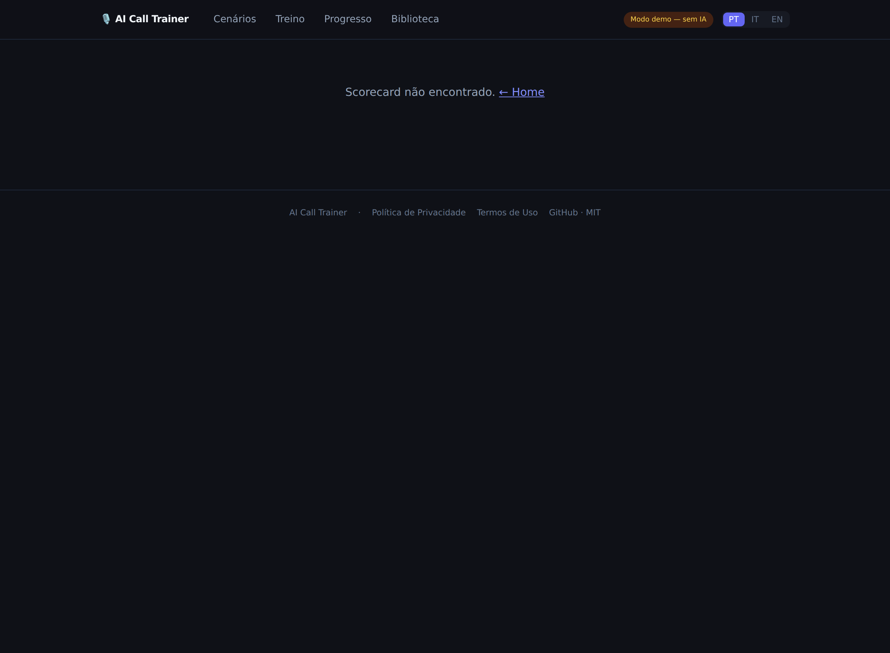
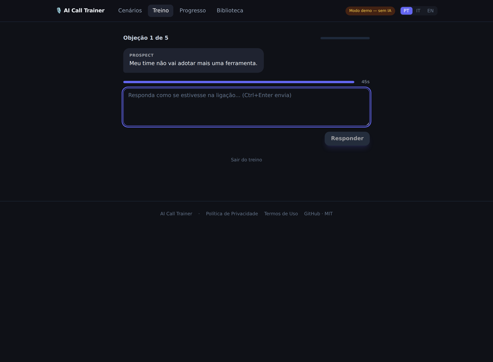
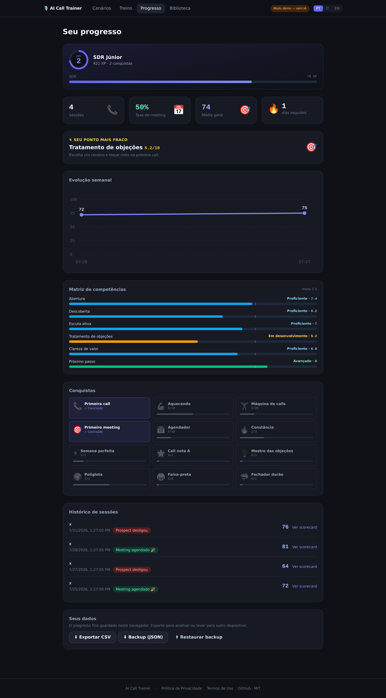

<p align="center">
  
</p>

<h1 align="center">🎙️ AI Call Trainer</h1>

<p align="center">
  <b>Practise sales calls against an AI prospect and get a real scorecard —<br/>
  free, multilingual, and running entirely in your browser.</b>
</p>

<p align="center">
  🇧🇷 pt-BR&nbsp; · &nbsp;🇵🇹 pt-PT&nbsp; · &nbsp;🇮🇹 it-IT&nbsp; · &nbsp;🇺🇸 en-US
  &nbsp;&nbsp;•&nbsp;&nbsp; MIT &nbsp;&nbsp;•&nbsp;&nbsp; installable PWA &nbsp;&nbsp;•&nbsp;&nbsp; zero-config demo
</p>

<p align="center">
  
</p>

You pick a scenario, dial in, and hold a cold call or discovery call with a prospect
played by Claude. The prospect has their own pains, hidden objections, personality and
mood, and they push back like the real thing. When you hang up, you get a structured
performance scorecard: a score per criterion, objective conversation metrics, an
objection-by-objection breakdown, and one thing to focus on next time.

**Languages:** 🇧🇷 pt-BR · 🇵🇹 pt-PT · 🇮🇹 it-IT · 🇺🇸 en-US (UI in PT / IT / EN)

> **Why this exists.** SDRs only get to practise on live calls — burning real leads — or
> in human roleplay, which is expensive and rarely available. The tools that solve this
> are enterprise, priced per seat, and English-first. This one is free, built for a single
> person, and speaks Portuguese and Italian.

---

## Table of contents

- [How it works](#how-it-works)
- [Feature tour](#feature-tour)
- [Tech stack](#tech-stack)
- [Security model](#security-model)
- [Cost](#cost)
- [Running locally](#running-locally)
- [Connecting Claude (live mode)](#connecting-claude-live-mode)
- [Deploying to Vercel](#deploying-to-vercel)
- [Project structure](#project-structure)
- [Scoring model](#scoring-model)
- [Voice implementation notes](#voice-implementation-notes)
- [Your data](#your-data)
- [Cross-device sync (optional)](#cross-device-sync-optional)
- [Testing](#testing)
- [Roadmap](#roadmap)
- [License](#license)

---

## How it works

```
┌────────────┐   speech   ┌──────────────────┐   text    ┌──────────────────────┐
│    You     │───────────▶│  Web Speech API  │──────────▶│ Edge Fn: /roleplay   │
│ (browser)  │◀───────────│   (STT + TTS)    │◀──────────│  → Claude (persona)  │
└────────────┘   audio    └──────────────────┘   reply   └──────────────────────┘
      │                                                             │
      │ hang up                                                     ▼
      │                  ┌──────────────────────┐        ┌──────────────────────┐
      └─────────────────▶│ Edge Fn: /evaluate   │───────▶│ Supabase (sessions,  │
                         │  → Claude (coach)    │        │ turns, evaluations)  │
                         └──────────────────────┘        └──────────────────────┘
```

**Two separate brains, two separate prompts — never mixed:**

1. **The prospect (roleplay).** Stays in character, answers in short lines, raises
   objections, reveals pain only when you earn it. `temperature 0.8`, `max_tokens 200`.
2. **The coach (evaluator).** Receives the full transcript once, at the end, and returns
   the scorecard as validated JSON. `temperature 0.2`, with a re-ask on parse failure.

The prospect never knows it's being graded, which is what keeps the roleplay honest.

---

## Feature tour

### The call

<p align="center"></p>

- **Scenario cards** — persona × product × call type × difficulty × language.
- **Pre-call briefing** — who picks up, their personality bars, their **mood**, what you're
  selling, your objective, and the time limit.
- **Battle card** — a collapsible product playbook (value props, objection→answer,
  competitors, pricing) for pre-call prep, also available per product in the Library.
- **Voice or text.** Voice uses push-to-talk (Pointer Events + pointer capture, so the
  release is reliable on desktop) with a live transcript you can edit before sending. The
  briefing warns that browser voice needs Chrome/Edge (Brave/Safari disable it); anything
  unsupported falls back to text automatically.
- **Live call screen** — animated waveform, countdown timer, running transcript.
- The prospect can **end the call themselves** — badly, or by agreeing to a next step.

### The scorecard

<p align="center"></p>

- **Overall score** with an animated reveal, weighted by the framework's criteria.
- **One focus for next time** — the single highest-impact change, surfaced first so you
  aren't drowned in feedback.
- **Objective metrics** computed in code (see [Scoring model](#scoring-model)).
- **Score per criterion** with weights and a coach's comment.
- **Objection map** — every objection you faced, labelled *ignored*, *rebutted instantly*,
  or *explored properly*.
- **Missed buying signals**, **your opener rewritten**, and your **best / worst line**,
  all quoted from the transcript.
- **Full transcript**, collapsible.

### Objection Gauntlet (`/drill`)

<p align="center"></p>

Rapid-fire objection practice — the drill an SDR actually repeats daily. Real objections
from the product library come at you one at a time; you answer, get an **instant score**
(acknowledge → explore → respond), and see the **model answer** to compare against. Ends
with an average, a per-objection breakdown, and a personal best per product.

Optional **pressure mode** puts a 45-second countdown on each objection — run out of time
and the answer auto-submits, exactly like freezing on a live call. Great for building the
reflex to respond fast instead of overthinking.

Runs entirely client-side: **zero API cost and no latency**, which is what makes rapid-fire
viable.

### Progress dashboard (`/progress`)

<p align="center"></p>

- **Level & XP** — an 8-tier SDR career ladder (Trainee → Rainmaker) with XP earned per
  call (score + bonuses for booking a meeting and for hard scenarios).
- **Achievements** — 12 badges (first meeting, streaks, polyglot, black belt, tough
  closer…), all derived from your history.
- **Skill matrix** — each criterion banded into a named competency (Novice → Advanced)
  with a proficiency-target marker.
- **Meeting rate** — the SDR north-star metric — plus weekly trend, session history, streak.
- **Export CSV** (analysis dataset) and **JSON backup / restore** (see [Your data](#your-data)).

### Adaptive coach

The Home screen opens with a **recommended next step** computed from your progress: make
your first call, drill objections, focus your weakest skill, or work on closing more
meetings — each linking straight to the right screen.

### Library (`/library`)

CRUD for your own products, personas and scenarios, on top of the Salesforce seed —
so you can train on *your* product, not the demo one. Each product shows its **battle card**.

### Also

- **Installable PWA** — add to your phone/desktop; the shell works offline.
- **Accessibility** — visible keyboard focus, `prefers-reduced-motion` support, a
  skip-to-content link, and a language-synced `<html lang>`.
- **Privacy & Terms** (`/legal`) — plain-language LGPD/GDPR disclosures linked in the footer.

---

## Tech stack

| Layer | Choice | Why |
|---|---|---|
| Frontend | React 18 + TypeScript + Vite | Fast, typed, zero-config |
| UI | Tailwind CSS + local component set | No component-library dependency to maintain |
| Animation | Framer Motion | Call transitions and the scorecard reveal |
| Speech-to-text | Web Speech API (`SpeechRecognition`) | Free, in-browser, supports pt-BR / pt-PT / it-IT / en-US |
| Text-to-speech | Web Speech API (`speechSynthesis`) | Free; voice is selectable per language |
| LLM | Claude API (`claude-haiku-4-5` by default) | The prospect and the coach; the only paid piece |
| Backend | Supabase (Postgres + Edge Functions) | Free tier; the Edge Function is what protects the API key |
| Hosting | Vercel | Free tier, deploys on push, HTTPS (required for the mic) |
| Tests | Vitest | Unit tests for the metric and scoring logic |

---

## Security model

> **The Anthropic API key never reaches the browser.**

Every LLM call goes through a Supabase Edge Function (`/roleplay`, `/evaluate`) that holds
the key as a secret. The browser only ever sees the Supabase anon key, which is public by
design. On top of that, the functions apply **per-device rate limiting** (defaults: 20 rep
turns per call, 6 calls/day, 8 evaluations/day) so a runaway loop can't run up a bill.

---

## Cost

| Item | Cost |
|---|---|
| Supabase (database + Edge Functions) | **€0** — free tier |
| Vercel (hosting) | **€0** — free tier |
| Demo mode (no Claude configured) | **€0** — prospect and evaluator are simulated locally |
| Objection Gauntlet | **€0** — scored client-side, no API calls |
| Claude API (live mode) | **pay-per-use** — no subscription, no minimum |

The default model is **Claude Haiku 4.5** ($1/M input, $5/M output tokens), which is both
the cheapest in the family and well suited to short in-character replies.

- One 10-turn call plus its evaluation ≈ 15–20k tokens ≈ **US$0.03**
- Realistic training use (1–3 calls a day, a few days a week) ≈ **under €1/month**
- Absolute worst case at the default limits (6 calls × 30 days) ≈ **~€5/month** — and only
  if you max out the daily cap every single day

**Three layers of cost protection**, innermost first:

1. Low `max_tokens` on every call (short lines are a design goal, not just a saving)
2. Per-device rate limits in the Edge Functions (table below)
3. A **spend limit in the Anthropic console** — a hard ceiling, not a subscription

Optional configuration, via Supabase secrets, no redeploy of code needed:

| Secret | Default | Purpose |
|---|---|---|
| `ANTHROPIC_MODEL` | `claude-haiku-4-5` | Model for the prospect |
| `ANTHROPIC_EVAL_MODEL` | same as `ANTHROPIC_MODEL` | Model for the coach — set to `claude-sonnet-4-6` for deeper feedback at ~3× the cost |
| `MAX_CALLS_PER_DAY` | `6` | Roleplay calls per device per day |
| `MAX_EVALS_PER_DAY` | `8` | Evaluations per device per day |
| `MAX_TURNS_PER_CALL` | `20` | Rep turns within a single call |

---

## Running locally

```bash
npm install
npm run dev        # http://localhost:5173
npm test           # unit tests
npm run build      # typecheck + production bundle
```

With nothing configured, the app runs in **demo mode**: the prospect and the evaluator are
simulated locally, at no cost and with no AI. Every screen and flow works, which makes it
the fastest way to see what the app does. A badge in the header marks the mode.

---

## Connecting Claude (live mode)

### Option A — browser only, no terminal

Follow [`supabase/dashboard-deploy/README.md`](supabase/dashboard-deploy/). The two
functions in that folder are single-file, copy-paste-ready builds (the Supabase dashboard
deploys one function at a time and doesn't resolve shared imports).

### Option B — Supabase CLI

```bash
supabase db push                                   # or paste supabase/migrations/0001_init.sql
supabase secrets set ANTHROPIC_API_KEY=sk-ant-...
supabase functions deploy roleplay
supabase functions deploy evaluate
```

Then copy `.env.example` to `.env` and fill in `VITE_SUPABASE_URL` and
`VITE_SUPABASE_ANON_KEY` (both from **Project Settings → API**; use the `anon` / public
key, never `service_role`).

Finally, set a **spend limit** in the Anthropic console. It's a safety ceiling — you still
only pay for what you use.

---

## Deploying to Vercel

Import the repository, add `VITE_SUPABASE_URL` and `VITE_SUPABASE_ANON_KEY` as environment
variables, and deploy. `vercel.json` already handles SPA routing, and Vercel's HTTPS is
what allows microphone access.

> **Vite bakes environment variables in at build time.** If you add or change them after a
> deploy, you must **redeploy** for the change to reach the site.

---

## Project structure

```
src/
├── components/
│   ├── call/            # PushToTalk, Waveform, Timer, TranscriptLive
│   ├── scorecard/       # ScoreReveal, CriterionCard, MetricsGrid, ImprovementList
│   ├── dashboard/       # ProgressChart, SessionHistory, StreakBadge, DataPanel
│   ├── library/         # ProductForm, PersonaForm, ScenarioBuilder
│   ├── dashboard/       # + LevelCard, Achievements, SkillMatrix
│   ├── BattleCard.tsx   # product playbook (briefing + library)
│   ├── NextBestAction.tsx  # adaptive coach card on Home
│   ├── Footer.tsx       # legal links (MIT repo)
│   ├── Onboarding.tsx   # first-visit intro
│   └── ui.tsx           # Button, Card, Badge, Input, Select, Textarea
├── data/
│   ├── seed/            # 4 Salesforce products, 6 personas, 8 scenarios
│   ├── frameworks.ts    # criteria and weights: basic / SPICED / MEDDIC
│   └── legal.ts         # trilingual privacy + terms content
├── hooks/
│   ├── useSpeech.ts     # STT + TTS behind one interface (+ mic errors, warmup)
│   ├── useCallSession.ts# the call state machine
│   ├── useProgress.ts   # historical metrics, streak, meeting rate
│   └── useGamification.ts  # XP / level / achievements from history
├── lib/
│   ├── api.ts           # roleplay/evaluate — Edge Functions or demo fallback
│   ├── metrics.ts       # conversation intelligence, computed in code
│   ├── thresholds.ts    # coaching targets — the "what good looks like" constants
│   ├── objections.ts    # gauntlet scoring (acknowledge → explore → respond)
│   ├── gamification.ts  # pure XP / levels / achievements engine
│   ├── coach.ts         # pure adaptive next-step + skill banding
│   ├── moods.ts         # prospect mood selection
│   ├── storage.ts       # persistence + backup/restore
│   ├── exporters.ts     # CSV and JSON export
│   ├── auth.ts          # Supabase Auth wrapper (magic link) for optional sync
│   ├── cloudSync.ts     # push/pull backup to the cloud (merge-by-id)
│   └── supabase.ts      # client + anonymous device id
├── components/CloudSync.tsx  # header sync dropdown (hidden in demo mode)
├── i18n/                # UI strings in PT / IT / EN
└── pages/               # Home, Call, Drill, Scorecard, Progress, Library, Legal
public/                  # PWA manifest, service worker, app icon
supabase/
├── functions/           # roleplay, evaluate, _shared (CLI deploys)
├── dashboard-deploy/    # same functions, single-file, for the web dashboard
└── migrations/          # 0001 schema+RLS+seed, 0002 user_backups (sync)
```

### Call state machine

```
briefing → listening | waiting_input → processing → speaking → (loop)
         → confirming_outcome → evaluating → scored
```

`confirming_outcome` exists because guessing the result would corrupt the meeting-rate
metric: when you hang up manually and the prospect hasn't already committed to a next
step, the app asks how the call actually ended.

---

## Scoring model

### Criteria and weights (basic framework)

| Criterion | Weight | What it measures |
|---|---|---|
| Opening | 15% | Pattern interrupt, permission, reason for the call in under 20s |
| Discovery | 25% | Open questions, qualification, did you dig into the pain? |
| Active listening | 15% | Did you respond to what they said, or follow a script? |
| Objection handling | 20% | Acknowledge → explore → respond |
| Value clarity | 10% | Did you connect a feature to *their* specific pain? |
| Next step | 15% | Did you ask for the meeting, with a concrete time? |

**SPICED** and **MEDDIC** are also defined, and the rubric is **chosen automatically by call
type**: cold call → basic, discovery → SPICED, negotiation → MEDDIC. A cold call and a
negotiation are different games and shouldn't be judged with the same ruler.

### Conversation intelligence (computed in code, zero AI cost)

Derived from the transcript and turn timestamps, in the spirit of Gong/Chorus:

- **Talk ratio** (target: rep ≤ 55%) and **longest rep monologue** (target: under 150 words)
- **Speaking pace** in words per minute (voice mode only)
- **Open vs. closed questions**, and **time to first question**
- **Filler words**, per language ("tipo", "né", "cioè", "like"…)
- **Concrete next step detected** (a day and a time)
- Duration against the scenario's time limit

All targets live in one place, `src/lib/thresholds.ts`.

### Deterministic overall score

The LLM assigns per-criterion scores and writes the comments. The **overall score is always
recomputed server-side** from those scores × the framework weights. The judgement is the
model's; the arithmetic is deterministic.

---

## Voice implementation notes

- `SpeechRecognition` is only reliable in **Chrome/Edge** — the app detects support and
  falls back to text mode automatically.
- **Push-to-talk** (hold the button or the space bar) rather than continuous recognition:
  far more robust with accents and background noise.
- The live transcript is **editable before you send it**, because STT will misfire.
- TTS voices vary by operating system, so the briefing lets you **pick the prospect's
  voice**; the choice is remembered per language.
- When the prospect ends the call, evaluation only starts **after** the TTS finishes
  speaking the final line.

---

## Your data

Sessions, turns, evaluations and your custom library live in this browser's `localStorage`
(and, when Supabase is configured, in Postgres as well). No account, no tracking.

From the Progress page you can:

- **Export CSV** — one row per session with scores and every objective metric. This is the
  dataset behind "my discovery score went from 5 to 8 in three weeks".
- **Export a JSON backup** and **restore it** — on another device, or after clearing your
  browser. Restore merges by id, so importing the same file twice never duplicates rows.

For a hands-off version of the same thing, see **cross-device sync** below.

---

## Cross-device sync (optional)

Backup/restore is manual. If you want your progress to follow you across devices
automatically, the header shows a **☁ Sync** button — but only when Supabase is configured
(in demo mode there's no cloud, so it stays hidden and the app is unaffected).

How it works:

- **Sign in with a magic link.** Enter your email, click the link Supabase sends, and you're
  in — no password. Auth is powered by Supabase Auth.
- **Save to cloud** uploads your whole local backup (the same object as the JSON export) into
  a private `user_backups` row keyed to your user id.
- **Pull from cloud** merges that row back into this device's `localStorage` — merge-by-id,
  so local-only sessions are never lost and pulling twice never duplicates anything.

`localStorage` stays the source of truth on each device; the cloud is just the shared copy
between your devices. Sync is entirely opt-in and additive — it touches a brand-new table and
nothing in the original schema, so it's safe to add to an existing deployment.

### Enabling it (two manual Supabase steps)

Sync rides on the same Supabase project you already use for live Claude mode. Beyond running
the migration, it needs two one-time settings in the Supabase dashboard:

1. **Run the migration** `supabase/migrations/0002_user_backups.sql` (Dashboard → SQL Editor,
   paste and run — or `supabase db push`). It creates the `user_backups` table with
   row-level security scoped to `auth.uid()`, so each user can only ever read or write their
   own row.
2. **Allow the redirect URL.** Dashboard → *Authentication → URL Configuration* → add your
   site URL (e.g. `https://your-app.vercel.app`, and `http://localhost:5173` for local dev)
   to **Site URL / Redirect URLs**. The magic link refuses to redirect anywhere not on this
   allowlist.
3. **Email delivery.** The built-in email provider works out of the box for low volume
   (rate-limited). For anything real, Dashboard → *Authentication → Providers → Email* and
   plug in your own SMTP so the links actually arrive.

> Because the anon key is public by design, RLS is what protects the data: a client can only
> touch the row where `auth.uid() = user_id`. Nothing in a user's backup is readable by
> anyone else.

---

## Testing

```bash
npm test           # Vitest, unit tests
npm run build      # tsc --build + vite build
```

Coverage focuses on the logic that must not silently drift: conversation metrics, question
classification, filler detection, next-step detection, streak calculation, framework
weighting, objection scoring and CSV escaping. CI runs tests, typecheck and build on every
push.

---

## Roadmap

- [x] **Phase 1 — Text MVP.** Roleplay chat, JSON evaluator, scorecard, deployment.
- [x] **Phase 2 — Voice.** Push-to-talk STT, TTS with voice selection, live transcript,
      automatic text fallback.
- [x] **Phase 3 — Serious scoring & progress.** SPICED/MEDDIC, conversation intelligence,
      objection map, meeting rate, weakest-area spotlight, CSV export.
- [x] **Phase 4 — Scale.** Library CRUD, Objection Gauntlet, prospect moods, onboarding,
      full PT/IT/EN localisation.
- [x] **Phase 5 — Accounts.** Opt-in cross-device sync via Supabase magic link
      (see [Cross-device sync](#cross-device-sync-optional)); pressure mode for the drill.
- [x] **Phase 6 — Engagement & polish.** Gamification (levels, XP, achievements), adaptive
      next-step coach, skill matrix, battle cards, route code-splitting, installable PWA
      with offline shell, WCAG pass, and Privacy/Terms pages.
- [ ] Premium TTS (ElevenLabs / OpenAI) for a less robotic prospect
- [ ] Server-side speech-to-text so voice works in any browser (incl. Brave)
- [ ] Generate a product card from a URL, so a stranger can train on their own product
- [ ] AE modes: guided demo and procurement negotiation

---

## License

MIT — see [LICENSE](LICENSE).
